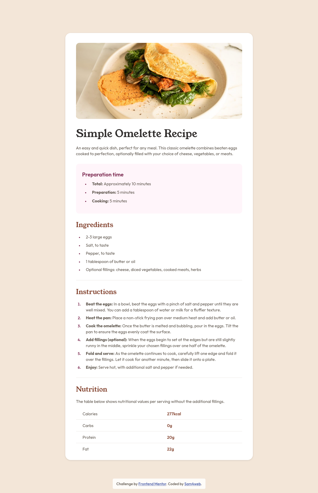

# Frontend Mentor - Recipe page solution

This is a solution to the [Recipe page challenge on Frontend Mentor](https://www.frontendmentor.io/challenges/recipe-page-KiTsR8QQKm). Frontend Mentor challenges help you improve your coding skills by building realistic projects. 

## Table of contents

- [Overview](#overview)
  - [Screenshot](#screenshot)
  - [Links](#links)
- [Built with](#built-with)
- [Author](#author)

## Overview

### Screenshot

### Links

- Solution URL: [Add solution URL here](https://www.frontendmentor.io/solutions/recipe-page-EiZMpFna1j)
- Live Site URL: [Live Site URL](https://sam4web.github.io/recipe-page/)

## Built with

- Semantic HTML5 markup
- CSS custom properties
- Mobile-first workflow

## Author

- Sijal Manandhar
- Github - [sam4web](https://github.com/sam4web/)
- Frontend Mentor - [@sam4web](https://www.frontendmentor.io/profile/sam4web)
